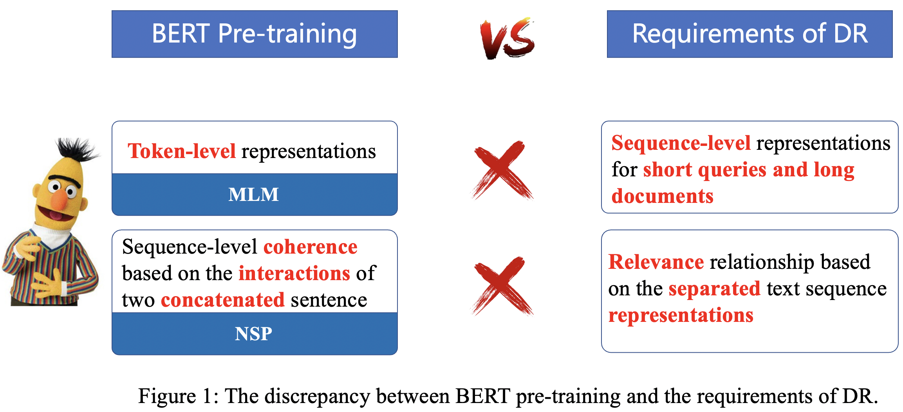

# COSTA
This is the official repo of our SIGIR'2022 paper,"[Pre-train a Discriminative Text Encoder for Dense Retrieval via Contrastive Span Prediction](https://arxiv.org/pdf/2204.10641.pdf)".


## Introduction

The foundation of effective search is high-quality text representation learning.
Modern dense retrieval models usually employ pre-trained models like BERT as the text encoder.
However, there is a gap between the pre-training objectives of BERT-like models and the requirements of dense retrieval as shown in Figure 1.
<!--  -->
<p align="center">
 
</p>
<!-- width="600" -->
<!-- Specifically, (1) dense retrieval needs to learn **text sequence representations for short queries and long documents** while BERT learns **word-level representaitons**; (2) dense retrieval needs to model **relevance** relationship based on the **seperated** text sequence **representations** while BERT only models **coherence** relationship based on the **interactions** of two **concatenated** sentence. -->

Existing works mainly utilize two types of methods to learn high-quality text sequence representations for dense retrieval, i.e., contrastive learning and the autoencoder-based language models.
We list the pros and cons of these two methods in Figure 2.
In this paper, therefore, we propose a novel COntrastive Span predicTion tAsk (**COSTA**), which leverages the merits of contrastive learning and autoencoder.
The key idea is to force the encoder to generate the text representation close to its own random spans while far away from others using a groupwise contrastive loss.
Our method only use the encoder and learn document-level text sequence representations by *”reconstructing”*  its own multiple spans.
We do not actually generate the original texts, and only force the text sequence representations to be close with its own multiple span representations of different granularities.
In this way, we can 
<ul>
<li> Learn discriminative text sequence representations effectively while avoiding designing complex data augmentation techniques for contrastive learning.
</li>
<li> Learn expressive text sequence representations efficiently while avoiding the bypass effect of autoencoder-based models thoroughly.
</li>
<li> Resemble the relevance relationship between the query and the document since spans with different granularities can be treated as pseudo queries.
</li>
</ul>


<p align="center">

</p>


## Pre-trained models in the Huggingface 🤗
We have uploaded COSTA pre-trained models to the Huggingface Hub, so you can easily use the COSTA models with [Huggingface/Transformers](https://github.com/huggingface/transformers) library.

Model identifier in Huggingface Hub:
- `xyma/COSTA-wiki`: The official COSTA model pre-trained on Wikipedia


For example,
```
tokenizer = AutoTokenizer.from_pretrained("xyma/COSTA-wiki")
model = AutoModel.from_pretrained("xyma/COSTA-wiki")
```


## Preparing Data

Download the **Wikipedia** from [the website](https://dumps.wikimedia.org/enwiki/latest/enwiki-latest-pages-articles.xml.bz2) and extract the text with [`WikiExtractor.py`](https://github.com/attardi/wikiextractor), and then apply any necessary cleanup and filter the short texts.

Download the two MS MARCO dense retrieval datasets from this [website](https://microsoft.github.io/msmarco/Datasets) and the two TREC 2019 Deep Learning Track datasets from this [website](https://microsoft.github.io/msmarco/TREC-Deep-Learning-2019).
Since these two TREC datasets use the same training set and dev set as the two MS MARCO datasets, so just download the test files.
Put these datasets on 
```
./data/marco-pas, ./data/marco-doc
```


## Pre-training
Stay tuned! Come back soon!

## Fine-tuning
Our fine-tunning code is based on the [texttron](https://github.com/texttron/tevatron) toolkit.

See [README.md](./scripts/msmarco-passage-ranking/README.md) for fine-tuning COSTA on passage retrieval datasets.

See [README.md](./scripts/msmarco-document-ranking/README.md) for fine-tuning COSTA on document retrieval datasets.


## Fine-tuning Results


| MS MARCO  Passage Retrieval  | MRR@10| Recall@1000 | Files |
|---|:---:|:---:|:---:|
| COSTA (BM25 negs) | 0.342 | 0.959 | [Model](https://drive.google.com/drive/folders/1dpjc8EF6qo1ZMxr_ZeMz80Zn0swc3Peh?usp=sharing), [Dev(MARCO format)](https://drive.google.com/file/d/1XIwxO-qPgFSZTW_tAAzF9Wdvhqgxi65x/view?usp=sharing), [Dev (TREC format)](https://drive.google.com/file/d/1AWieC-odKmm34nWrA3IPtBduWnMPbevk/view?usp=sharing)| 
| COSTA (hard negs) | 0.366 | 0.971 | [Model](https://drive.google.com/drive/folders/1YDP0v_xspiow_MeWB7i23Uu-Bf-j8Syu?usp=sharing), [Dev (MARCO format)](https://drive.google.com/file/d/13tJEAMOj8V9_TudMveTByVX100nGCKlj/view?usp=sharing), [Dev (TREC format)](https://drive.google.com/file/d/1WvmQ-QmLcILGSQLdaXLZfcv9zNw0jhRT/view?usp=sharing)|

| TREC 2019  Passage Retrieval  | NDCG@10| Recall@1000 | Files|
|---|:---:|:---:|:---:|
| COSTA (BM25 negs) | 0.635 | 0.773 | [Model](https://drive.google.com/drive/folders/1dpjc8EF6qo1ZMxr_ZeMz80Zn0swc3Peh?usp=sharing), [Test (TREC format)](https://drive.google.com/file/d/1Wix8s5zBuZ09zUNDO0zrpH9R8dlbLQ8c/view?usp=sharing)| 
| COSTA (hard negs) | 0.704 | 0.816 | [Model](https://drive.google.com/drive/folders/1YDP0v_xspiow_MeWB7i23Uu-Bf-j8Syu?usp=sharing), [Test (TREC format)](https://drive.google.com/file/d/1iD71Pt6vvg6YKvwZILRVypcQuYwpSr2C/view?usp=sharing)|


Run the following code to evaluate COSTA on MS MARCO Passage dataset.
```
./eval/eval_msmarco_passage.sh   ./marco_pas/qrels.dev.tsv ./costa_hd_neg8_e2_bs8_fp16_mrr10_366_r1000_971/encoding/dev.rank.tsv.marco
```
You will get
```
#####################
MRR @ 10: 0.36564396006731276
QueriesRanked: 6980
#####################
```


Run the following code to evaluate COSTA on TREC2019 Passage dataset.
```
./eval/trec_eval -m ndcg_cut.10 -m recall.1000  -c -l 2 ./marco_pas/qrels.dl19-passage.txt ./costa_hd_neg8_e2_bs8_fp16_mrr10_366_r1000_971/encoding/trec.rank.tsv.trec
```

You will get
```
recall_1000             all     0.8160
ndcg_cut_10             all     0.7043
```


| MS MARCO  Document Retrieval  | MRR@100| Recall@100 | Files |
|---|:---:|:---:|:---:|
| COSTA (1st iteration hard negs) | 0.395 | 0.894 | [Model](https://drive.google.com/drive/folders/1uxmj8yyI7b4WPvaXwkyLWtSQzQQqXkqq?usp=sharing), [Dev(MARCO format)](https://drive.google.com/file/d/1HlI19nxOZ6C5u6jVnHQsUhGeyG2fwqNk/view?usp=sharing), [Dev (TREC format)](https://drive.google.com/file/d/1XsZn4NyAgoafeASXxzT9MSYEjemH1qsB/view?usp=sharing)| 
| COSTA (2nd iteration hard negs) | 0.422 | 0.917 | [Model](https://drive.google.com/drive/folders/1u-sGu_Rk8moIPJTgQl66ziUuy_X22NmX?usp=sharing), [Dev (MARCO format)](https://drive.google.com/file/d/1BVwp3dRuYJYrBdgUtb5PWa9GR7rKFf0S/view?usp=sharing), [Dev (TREC format)](https://drive.google.com/file/d/1rw46Xu6SehYl8CBvk99MO-Frk204tqvD/view?usp=sharing)|


| TREC 2019  Document Retrieval  | NDCG@10| Recall@100 | Files|
|---|:---:|:---:|:---:|
| COSTA (1st iteration hard negs) | 0.582 | 0.278 | [Model](https://drive.google.com/drive/folders/1uxmj8yyI7b4WPvaXwkyLWtSQzQQqXkqq?usp=sharing), [Test (TREC format)](https://drive.google.com/file/d/1qjv-i106FgyoAQmOXwpc2NZmA19gnphh/view?usp=sharing)| 
| COSTA (2nd iteration hard negs) | 0.626 | 0.320 | [Model](https://drive.google.com/drive/folders/1u-sGu_Rk8moIPJTgQl66ziUuy_X22NmX?usp=sharing), [Test (TREC format)](https://drive.google.com/file/d/1CJ_-xYhijJzgCvympKcv3TicZnk9xQvb/view?usp=sharing)|

Run the following code to evaluate COSTA on MS MARCO Document dataset.
```
./eval/eval_msmarco_doc.sh   ./marco_doc/qrels.dev.tsv ./costa_doc_w_doc395hn200_neg8_e1_bs8_extend_doc395_mrr100_422_r100_917/encoding/dev.rank.tsv.marco
```
You will get
```
#####################
MRR @ 100: 0.4215861855110516
QueriesRanked: 5193
#####################
```


Run the following code to evaluate COSTA on TREC2019 Document dataset.
```
./eval/trec_eval -m ndcg_cut.10 -m recall.100  ./marco_doc/msmarco-trec19-qrels.txt ./costa_doc_w_doc395hn200_neg8_e1_bs8_extend_doc395_mrr100_422_r100_917/encoding/trec.rank.tsv.trec
```

You will get
```
recall_100             all     0.3202
ndcg_cut_10            all     0.6260
```


## Citation
If you find our work useful, please consider citing our paper:

```
@inproceedings{ma2022costa,
  author = {Ma, Xinyu and Guo, Jiafeng and Zhang, Ruqing and Fan, Yixing and Cheng, Xueqi},
  title = {Pre-Train a Discriminative Text Encoder for Dense Retrieval via Contrastive Span Prediction},
  year = {2022},
  address = {New York, NY, USA},
  url = {https://doi.org/10.1145/3477495.3531772},
  doi = {10.1145/3477495.3531772},
  pages = {848–858},
  numpages = {11},
  location = {Madrid, Spain},
  series = {SIGIR '22}
}

```